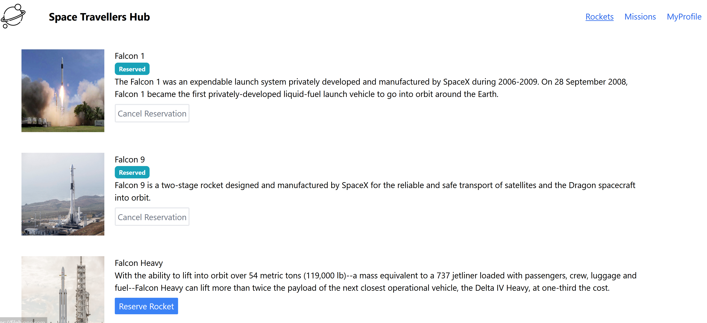
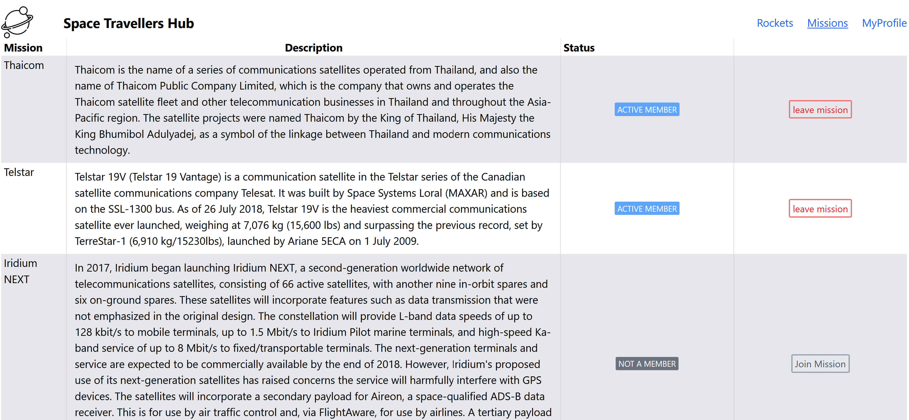
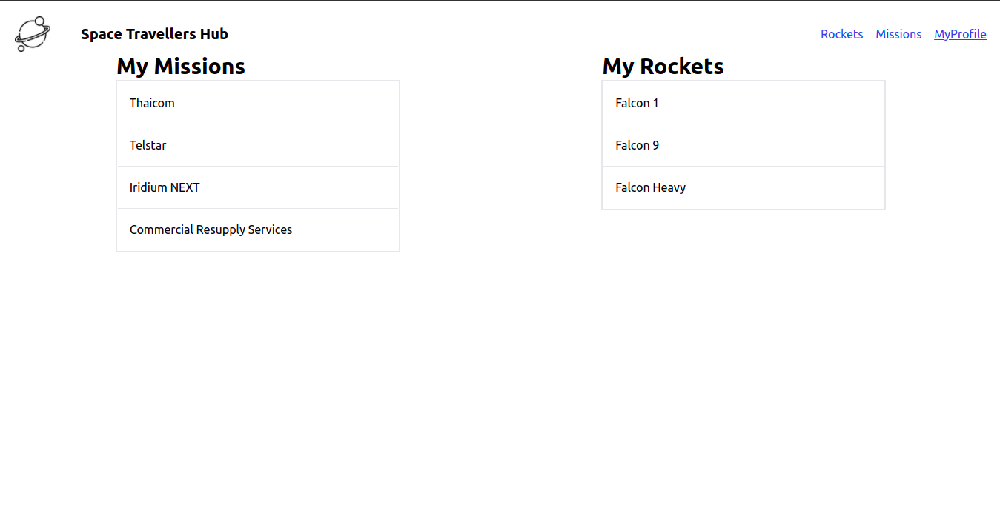

# Space-Travellers-Hub

This is react-redux project that involves creating a rocket and mission booking for space adventures. It uses the SpaceX API to get the data that is implemented using axios and thunk.

## Built With
- jsx
- Tailwindcss
- Javascript
- React
- Redux

## Live Demo

[Live Version](https://spacetravellershub.netlify.app/)

## Getting Started

To get a local copy up and running follow these simple example steps.

## Install

In your terminal, navigate to your current directory and run this code

`git clone https://github.com/topeogunleye/Space-Travellers-Temi-Affax.git`

Locate the directory in your file explorer

`cd Space-Travellers-Temi-Affax`

Install npm or if installed already using this link

`npm install`

Start the web dev server depending on your configuration

`npm start`

The Project should now be live on your browser

## Authors

👤 **Author1**

- GitHub: [@DelhinRharl](https://github.com/DelhinRharl)
- Twitter: [@tdelhinrharl](https://twitter.com/delhinrharl)
- LinkedIn: [LinkedIn](https://linkedin.com/in/affaxed-kiprotich)

👤 **Author1**
- GitHub: [@githubhandle](https://github.com/topeogunleye)
- Twitter: [@twitterhandle](https://twitter.com/topeogunleye21)
- LinkedIn: [LinkedIn](https://linkedin.com/in/ogunleye)

Contributions, issues, and feature requests are welcome!

Feel free to check the [issues page](https://github.com/topeogunleye/issues).

## Show your support

Give a ⭐️ if you like this project!
## 📝 License

This project is [MIT](./MIT.md) licensed.